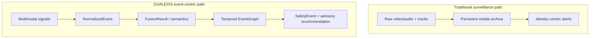
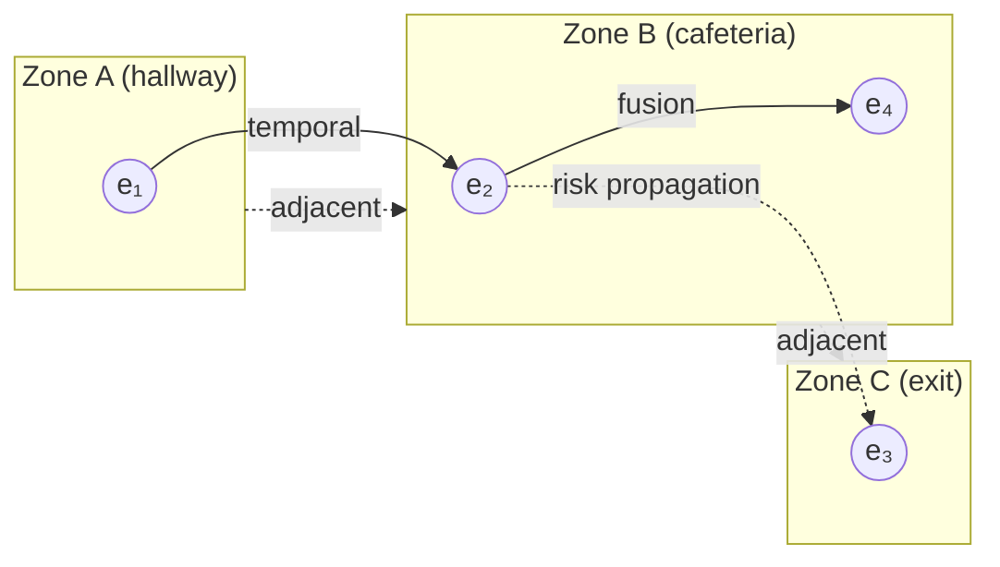
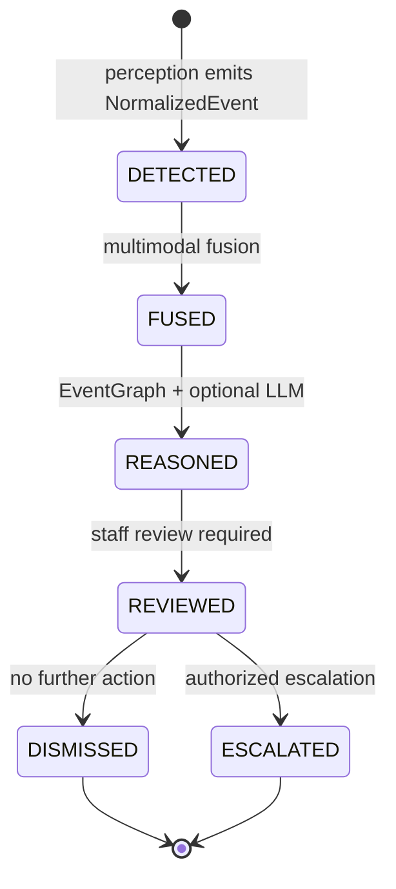
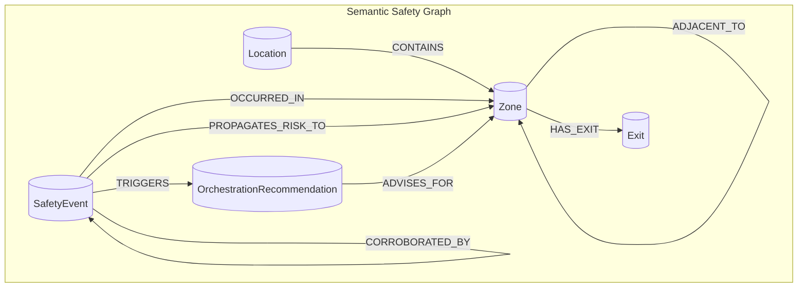

# DUALEXIS Architecture

DUALEXIS is a privacy-first AI safety orchestration framework designed for schools
and confined public spaces. It provides **privacy-preserving cognitive safety
infrastructure** — not surveillance software.

## Design Principles

| Principle | Implementation |
| --------- | -------------- |
| Privacy-first | Strict default policy; no biometrics |
| Edge-first | Perception and fusion at the boundary |
| Event-centric | Structured `SafetyEvent` as the core unit |
| Human-in-the-loop | Reasoning produces recommendations, not actions |
| Explainable | Semantic descriptors and audit trails |
| No persistent media | Ephemeral buffers with configurable TTL |

## Event-Centric Safety Model

DUALEXIS reasons about **events**, **zones**, and **semantic context** — never
about individual identities. The model supports research into temporal evolution,
risk propagation, environmental change, crowd dynamics, and multimodal signal
fusion within confined spaces.

### Reasoning substrate

| Dimension | What the system models | What it excludes |
| --------- | ---------------------- | ---------------- |
| **Events** | Typed `NormalizedEvent`, `FusionResult`, `SafetyEvent` | Person IDs, tracks |
| **Zones** | `LocationReference` (zone_id, zone_label, site_id) | Individual location history |
| **Semantic context** | `SemanticDescriptor` categories and explanations | Biometric attributes |
| **Temporal evolution** | `EventGraph` sliding-window context | Cross-session identity linking |
| **Risk propagation** | Decaying priors across adjacent zones | Cross-zone person tracking |
| **Environmental change** | `ENVIRONMENTAL_SENSOR` events | — |
| **Crowd dynamics** | Aggregate `CROWD_ACTIVITY` descriptors | Per-person identification |
| **Multimodal signals** | Modality provenance and fusion weights | Raw media in events |

### Surveillance vs. event-centric architecture



| Surveillance-centric | DUALEXIS event-centric |
| -------------------- | ---------------------- |
| Persistent media archive | Ephemeral edge buffers |
| Identity / track graph | Zone-local event graph |
| Black-box alert score | Explainable `SafetyEvent` |
| Automated escalation | Advisory `OrchestrationRecommendation` |
| Centralized analytics | Edge-first normalization |

Identity fields and biometric evidence keys **fail schema validation** rather than
being stripped downstream — privacy is enforced by architecture, not policy alone.

### Zone–event graph



- **Solid edges**: temporal co-occurrence or multimodal fusion links
- **Dashed edges**: static zone adjacency (architectural topology)
- **Dotted edges**: risk propagation (event-level influence, not person tracking)

## System Overview

```
┌─────────────────────────────────────────────────────────────────┐
│                        Edge Node                                │
│  ┌──────────┐  ┌──────────┐  ┌──────────┐                      │
│  │  Video   │  │  Audio   │  │  Sensor  │  Perception Layer    │
│  │ Pipeline │  │ Pipeline │  │ Pipeline │  (no biometrics)     │
│  └────┬─────┘  └────┬─────┘  └────┬─────┘                      │
│       └──────────────┼─────────────┘                            │
│                      ▼                                          │
│              ┌───────────────┐                                  │
│              │ Privacy Guard │                                  │
│              └───────┬───────┘                                  │
│                      ▼                                          │
│              ┌───────────────┐                                  │
│              │ Fusion Engine │  Multimodal semantic fusion      │
│              └───────┬───────┘                                  │
│                      ▼                                          │
│              ┌───────────────┐                                  │
│              │   Reasoning   │  Local LLM over structured events│
│              │    Engine     │                                  │
│              └───────┬───────┘                                  │
│                      ▼                                          │
│              ┌───────────────┐                                  │
│              │  Event Graph  │  Temporal context + propagation  │
│              └───────┬───────┘                                  │
│                      ▼                                          │
│              ┌───────────────┐                                  │
│              │   Publisher   │  Structured SafetyEvent output   │
│              └───────────────┘                                  │
└─────────────────────────────────────────────────────────────────┘
                              │
                              ▼
┌─────────────────────────────────────────────────────────────────┐
│                     Orchestrator / API                          │
│  Federation · Audit · Human review interface                    │
└─────────────────────────────────────────────────────────────────┘
```

## Normalized Event Taxonomy

Top-level types map to `EventType` in `dualexis/schemas/domain/enums.py`.
Semantic subtypes are expressed via `labels` and `SemanticDescriptor.category`.

| `EventType` | Typical signals | Example semantic subtypes | Reasoning use |
| ----------- | --------------- | ------------------------- | ------------- |
| `ZONE_ACTIVITY` | Video motion, PIR | `ingress_surge`, `corridor_congestion` | Baseline zone state |
| `CROWD_ACTIVITY` | Video density, audio level | `density_elevated`, `flow_counterflow` | Aggregate crowd dynamics |
| `ACOUSTIC_ANOMALY` | Microphones | `impact_like`, `alarm_tone` | Non-linguistic acoustic cues |
| `ENVIRONMENTAL_SENSOR` | IoT, HVAC, doors | `temperature_spike`, `door_forced` | Environmental change |
| `MULTIMODAL_FUSION` | ≥ 2 modalities | `corroborated_distress_cue` | Cross-signal validation |
| `UNKNOWN` | Any | `unclassified_signal` | Safe fallback; triggers review |

`EventSeverity` (`INFO` … `CRITICAL`) is orthogonal to type and expresses operational
urgency without attributing events to individuals.

## Event Lifecycle



| `EventStatus` | Entry condition | Next states |
| ------------- | --------------- | ----------- |
| `DETECTED` | Perception produced normalized events | `FUSED` |
| `FUSED` | `FusionResult` attached | `REASONED` |
| `REASONED` | Graph context + optional recommendation | `REVIEWED` |
| `REVIEWED` | `HumanReviewStatus.COMPLETED` | `DISMISSED`, `ESCALATED` |
| `DISMISSED` / `ESCALATED` | Terminal disposition | — |

Parallel operator workflow uses `HumanReviewStatus`: `NOT_REQUIRED`, `PENDING`,
`IN_PROGRESS`, `COMPLETED`, `DISMISSED`, `ESCALATED`.

## Temporal Event Propagation Model

Risk propagation describes how high-severity zone events influence **adjacent zones**
over time — without tracking people across space.

### Parameters (research defaults)

| Symbol | Meaning | Reference default |
| ------ | ------- | ----------------- |
| `W` | Context sliding window | 5 minutes (`EventGraph.get_context`) |
| `Δt_fuse` | Multimodal corroboration window | Pipeline-configurable |
| `τ_prop` | Propagation threshold on composite score | Policy-configurable |
| `α` | Adjacent-zone coupling strength | `(0, 1]` |
| `λ` | Temporal decay rate | Policy-configurable |

### Composite score

For event `e`:

```
r(e) = w_s · sev(e) + w_c · conf(e)
```

- `sev(e)`: `EventSeverity` mapped to `[0, 1]`
- `conf(e)`: `ConfidenceScore.value`

### Propagation update

When anchor event `e` in zone `z` exceeds `τ_prop`, adjacent zone `z'` receives:

```
r_prior(z', t) ← max(r_prior(z', t), α · r(e) · exp(-λ · (t - t(e))))
```

Elevated priors may increase fusion sensitivity or emit
`OrchestrationAction.REQUEST_REVIEW`. They do **not** identify or track persons.

### Multimodal corroboration

Independent modalities producing events in the same zone within `Δt_fuse` are linked
in the event graph. Fusion records per-modality weights in
`FusionResult.modality_contributions`.

## Privacy and Regulatory Alignment

### Why this model is more privacy-preserving

1. **Structural data minimization** — only zone-level structured descriptors cross trust boundaries; raw media stay ephemeral.
2. **No identity graph** — reasoning operates on events anchored to zones, not persons.
3. **Validation-by-default** — biometric keys and identity labels are rejected at construction time.
4. **Bounded retention** — `RetentionPolicy` tiers bind metadata lifetime to event class.
5. **Metadata-only audit** — compliance logs never contain raw sensor payloads.

### GDPR alignment (engineering support, not legal certification)

| GDPR principle | DUALEXIS mechanism |
| -------------- | ------------------ |
| Data minimization (Art. 5(1)(c)) | Ephemeral buffers; structured events only |
| Purpose limitation (Art. 5(1)(b)) | Typed safety semantics, not open profiling |
| Storage limitation (Art. 5(1)(e)) | `RetentionPolicy` per event |
| Accountability (Art. 5(2)) | Append-only `AuditEntry` with integrity hashes |
| DPIA support (Art. 35) | Documented validators, policies, audit artifacts |

### EU AI Act alignment (engineering support)

| Requirement | DUALEXIS mechanism |
| ----------- | ------------------ |
| Human oversight (Art. 14) | `requires_human_approval=True` on recommendations |
| Transparency (Art. 13) | Mandatory `explanation` and `ConfidenceScore.rationale` |
| Unacceptable-risk avoidance | Biometrics and identity linking excluded by schema |

## Semantic Safety Graph

DUALEXIS generalizes the in-memory `EventGraph` into a **Semantic Safety Graph (SSG)** —
a property-graph knowledge structure connecting locations, zones, exits, events,
temporal transitions, risk propagation, and orchestration recommendations.

**No identity or biometric nodes are permitted.**



| Capability | Isolated alerts | SSG orchestration |
| ---------- | --------------- | ----------------- |
| Temporal context | None | `FOLLOWED_BY` edges |
| Cross-zone awareness | Single zone | `ADJACENT_TO`, `PROPAGATES_RISK_TO` |
| Multimodal fusion | Siloed scores | `CORROBORATED_BY` links |
| Human governance | Boolean alert | `OrchestrationRecommendation` nodes |

Local LLMs receive **serialized subgraph JSON** (see `examples/safety_graph_subgraph.json`)
via `ReasoningRequest` — never raw media.

Full specification: **[Semantic Safety Graph](safety_graph.md)** (Neo4j model, Cypher examples, LLM prompt structure).

## Module Map

| Module | Path | Responsibility |
| ------ | ---- | -------------- |
| Core | `dualexis/core/` | Interfaces, config, exceptions |
| Schemas | `dualexis/schemas/` | Pydantic v2 data models |
| Perception | `dualexis/perception/` | Ephemeral signal extraction |
| Fusion | `dualexis/fusion/` | Multimodal semantic combination |
| Graph | `dualexis/graph/` | Event relationship tracking |
| Reasoning | `dualexis/reasoning/` | Local LLM decision support |
| Privacy | `dualexis/privacy/` | Policy enforcement |
| Orchestration | `dualexis/orchestration/` | End-to-end pipeline |
| Federation | `dualexis/federation/` | Cross-node coordination |
| Audit | `dualexis/audit/` | Compliance logging |

## Applications

| App | Entry Point | Purpose |
| --- | ----------- | ------- |
| API | `apps/api/` | REST interface for event management |
| Edge Node | `apps/edge_node/` | Edge deployment runner |
| Orchestrator | `apps/orchestrator/` | Multi-node coordination |
| Simulator | `apps/simulator/` | Synthetic frame generation |

## Extension Points

Implement these interfaces to add real backends:

- `PerceptionPipeline` — connect real edge models
- `FusionEngine` — custom fusion strategies
- `ReasoningEngine` — integrate a local LLM
- `PrivacyGuard` — site-specific policy rules
- `EventPublisher` — Kafka, MQTT, HTTP, etc.
- `AuditLogger` — persistent audit storage

## Related Documentation

- [Formal Framework](framework.md)
- [Edge Deployment Architecture](edge_infrastructure.md)
- [Semantic Safety Graph](safety_graph.md)
- [Privacy Model](privacy.md)
- [Development Guide](development.md)
