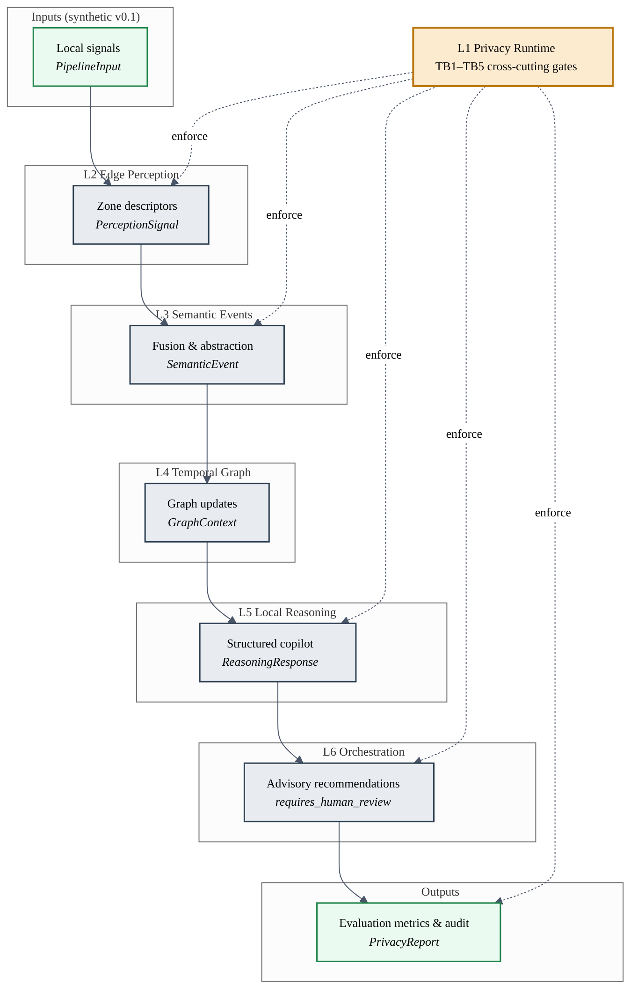
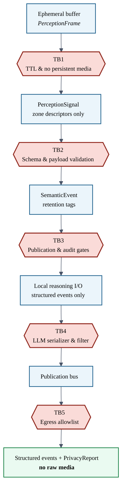
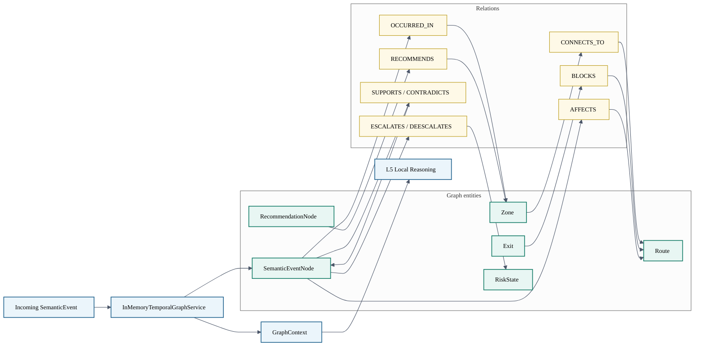
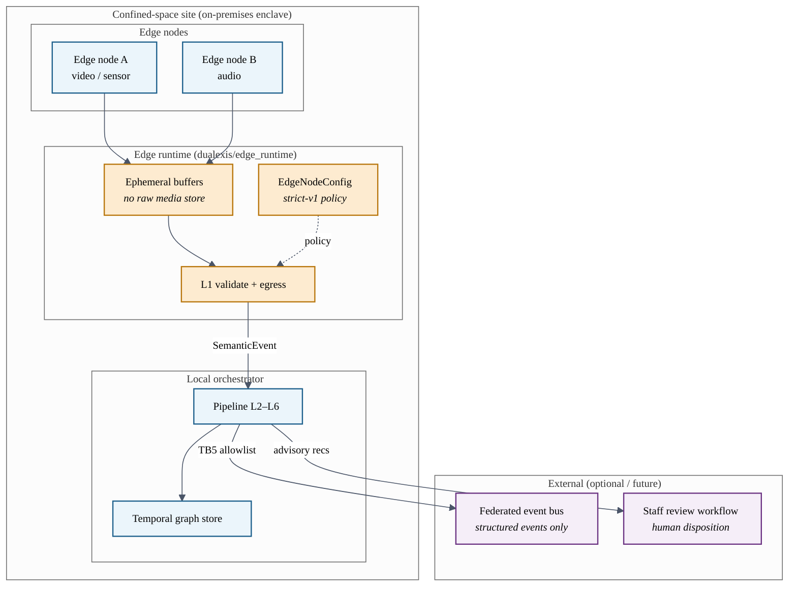
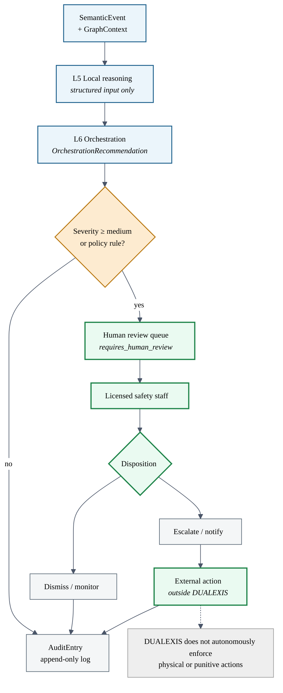
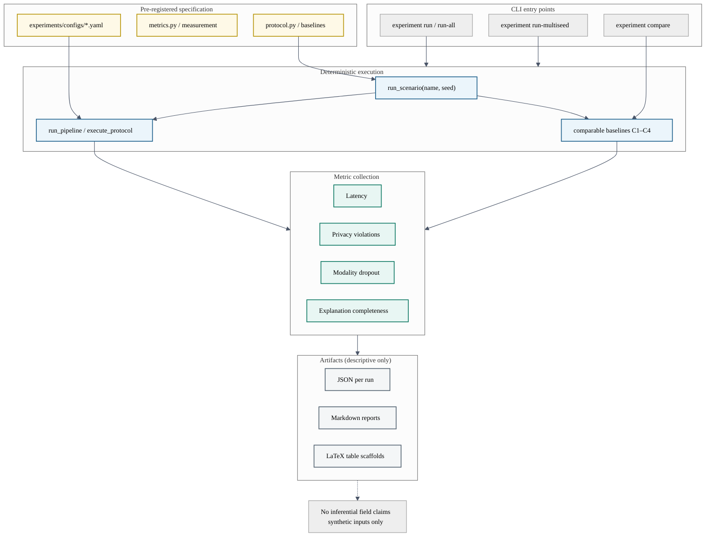

# Markdown Mermaid embeds

Copy any block below into documentation pages. Sources of truth: sibling `.mmd` files.
See [README.md](README.md) for PDF rendering and LaTeX includes.

---

## 1. End-to-end pipeline

---

## 2. Privacy runtime

---

## 3. Temporal safety graph

---

## 4. Edge deployment architecture

---

## 5. Human-in-the-loop orchestration

---

## 6. Experimental evaluation workflow

