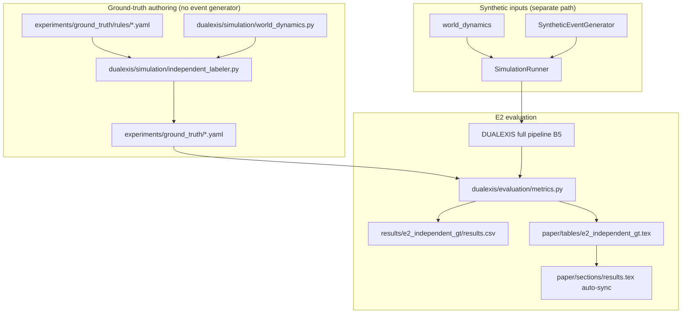

# E2 — Independent ground-truth pipeline

Empirical validity package: ground truth is authored from **separate YAML rules** and **world dynamics only**; evaluation compares DUALEXIS (B5) outputs to frozen labels in `experiments/ground_truth/`.

## 1. Architecture diagram



**Separation guarantees**

| Component | Uses event generator? | Uses GT YAML rules? |
|-----------|----------------------|---------------------|
| `independent_labeler` | No | Yes |
| `SyntheticEventGenerator` | Yes (emits events) | No |
| `ComparableBaselineResult` metrics | No (reads YAML GT) | Loads YAML only |

## 2. Files created / touched

| Path | Role |
|------|------|
| `experiments/ground_truth/rules/*.yaml` | Per-scenario labeling rules (thresholds, zones) |
| `experiments/ground_truth/*.yaml` | Frozen independent labels (regenerated from rules) |
| `dualexis/simulation/world_dynamics.py` | Shared world stepping (no events) |
| `dualexis/simulation/gt_rules.py` | Rule loader and evaluator |
| `dualexis/simulation/independent_labeler.py` | GT authoring from rules + world |
| `dualexis/simulation/ground_truth_loader.py` | YAML load for evaluation |
| `dualexis/experiments/e2_independent_gt.py` | E2 multiseed battery + exports |
| `scripts/generate_independent_ground_truth.py` | Regenerate YAML from rules |
| `results/e2_independent_gt/results.csv` | Per seed × scenario metrics |
| `paper/tables/e2_independent_gt.tex` | LaTeX table (`tab:e2-independent-gt`) |

## 3. Evaluation commands

Regenerate ground-truth YAML from rules:

```bash
python3.12 scripts/generate_independent_ground_truth.py
```

Run full E2 package ($N=30$ seeds, all scenarios, CSV + LaTeX + `results.tex` sync):

```bash
pip install -e .
python3.12 -m dualexis.cli experiment e2
```

Options:

```bash
python3.12 -m dualexis.cli experiment e2 \
  --output results/e2_independent_gt \
  --paper-tex paper/tables/e2_independent_gt.tex \
  --results-tex paper/sections/results.tex \
  --seeds 1,2,3,...,30 \
  --skip-regenerate-yaml
```

## 4. Generated tables

After `experiment e2`:

- **CSV:** `results/e2_independent_gt/results.csv` — columns: scenario, seed, GT label count, detection accuracy, FPR, FNR, explanation completeness, privacy violations.
- **LaTeX:** `paper/tables/e2_independent_gt.tex` — Table~\ref{tab:e2-independent-gt} (mean Acc./FPR/FNR/$S_{\mathrm{expl}}$ per scenario).
- **Manuscript hook:** `paper/sections/results.tex` block between `% <e2-auto-tables>` … `% </e2-auto-tables>` (auto-updated; narrative paragraphs unchanged).

## 5. Limitations

1. **Synthetic only** — world model and rules are code-authored; no field or operator data.
2. **Shared world dynamics** — simulation and GT authoring use the same `advance_world_state`; only **labeling rules** and **event emission** are decoupled.
3. **Reference seed for YAML** — `experiments/ground_truth/*.yaml` are produced at seed `0`; multiseed evaluation varies pipeline inputs while GT files stay fixed per scenario (standard practice for frozen labels).
4. **Descriptive statistics** — means over 30 seeds; no inferential tests or superiority claims.
5. **Placeholder L2/L5** — perception and reasoning use scaffold implementations; metrics measure protocol alignment, not production CV/LLM quality.
6. **Not a privacy certification** — fuzz and violation counts are harness checks only.
