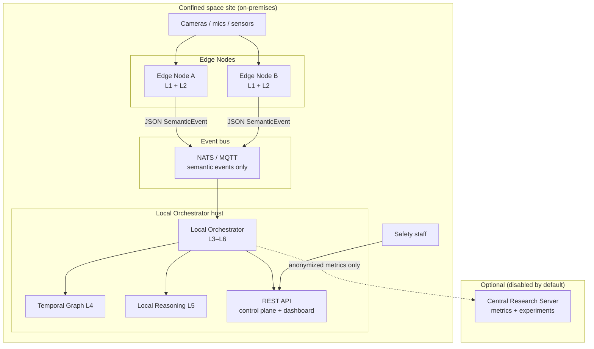
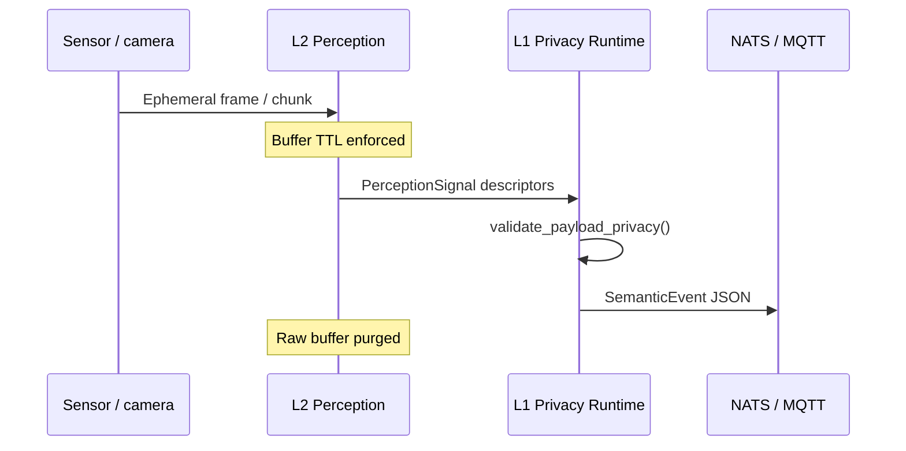
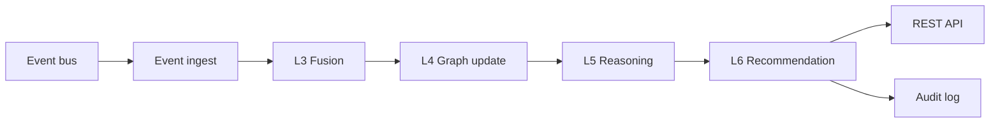
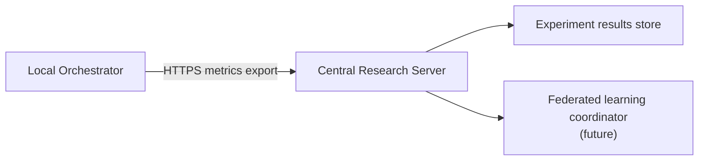
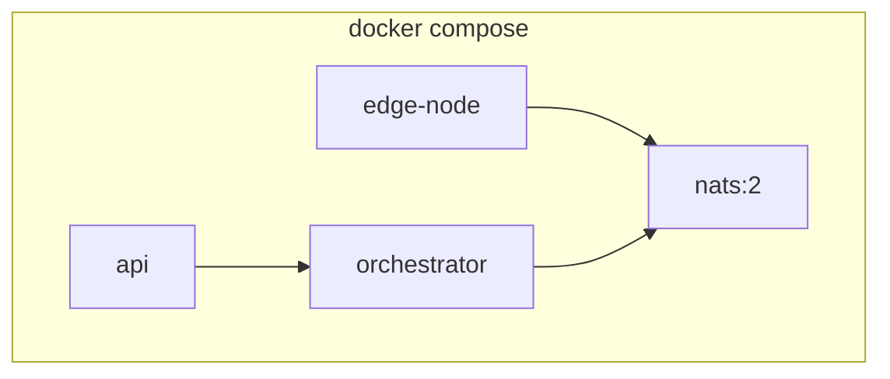

# DUALEXIS Edge Deployment Architecture

This document defines the **edge-native deployment model** for DUALEXIS: how perception, privacy enforcement, orchestration, and optional central research aggregation are distributed across nodes **without cloud dependency by default**.

Related: [architecture.md](architecture.md), [privacy.md](privacy.md), [framework.md](framework.md).

---

## Design goals

| Goal | Mechanism |
| ---- | --------- |
| Privacy by default | Raw media stays ephemeral on edge nodes; only `SemanticEvent` JSON crosses service boundaries |
| No cloud dependency | Full stack runs on-premises via Docker Compose or K3s |
| Operational isolation | Edge Node vs Local Orchestrator vs optional Central Research Server |
| Research reproducibility | Central server ingests **anonymized metrics only** (no raw media, no identities) |
| GPU acceleration | Optional NVIDIA runtime for L2 perception and future L5 local LLM |

---

## Deployment topology



**Default data flow:** ephemeral raw signals never leave the Edge Node. The Local Orchestrator receives structured events, fuses them, updates the temporal graph, invokes local reasoning, and publishes human-review recommendations to the REST control plane.

---

## Component model

### 1. Edge Node

**Role:** Capture-adjacent inference and privacy gate at trust boundary TB1–TB2.

| Responsibility | Layer | Notes |
| -------------- | ----- | ----- |
| Run perception models | L2 | Video, audio, sensor pipelines on ephemeral buffers |
| Ephemeral raw processing | L2 | Frames/audio chunks discarded after TTL |
| Privacy runtime enforcement | L1 | Reject biometrics, strip media refs, enforce retention |
| Emit semantic events only | L3 egress | Publish JSON to NATS/MQTT |

**Must not:**

- Persist raw video/audio by default
- Publish identity fields or biometric embeddings
- Run multimodal fusion or temporal graph (delegated to orchestrator)

**Reference implementation:** `apps/edge_node/`, `dualexis/edge_perception/`, `dualexis/privacy_runtime/`.



### 2. Local Orchestrator

**Role:** Site-level semantic fusion, graph maintenance, reasoning, and staff-facing recommendations.

| Responsibility | Layer | Notes |
| -------------- | ----- | ----- |
| Receive semantic events | L3 ingress | Subscribe to per-zone or per-site subjects |
| Multimodal fusion | L3 | Combine streams from multiple edge nodes |
| Update temporal safety graph | L4 | In-memory or Neo4j backend |
| Local reasoning | L5 | Structured-event copilot (no raw media) |
| Human-review recommendations | L6 | Advisory actions; review gates for high severity |

**Reference implementation:** `apps/orchestrator/`, `dualexis/orchestration/`, `dualexis/temporal_graph/`, `dualexis/local_reasoning/`.



### 3. Optional Central Research Server

**Role:** Off-site or lab aggregation for **evaluation and research** — not operational safety control.

| Allowed | Prohibited |
| ------- | ---------- |
| Anonymized `ExperimentReport` / metric bundles | Raw media |
| Aggregated latency and error-rate statistics | Semantic events with re-identification risk |
| Protocol IDs, seeds, scenario names | Personal identities |
| Future: federated learning gradients (planned) | Biometric features |

Disabled by default. Enable only with explicit institutional policy and network segmentation.



---

## Communication plane

### Event streaming (NATS or MQTT)

Primary transport for **SemanticEvent** records from Edge Nodes to the Local Orchestrator.

| Subject / topic pattern | Publisher | Consumer | Payload |
| ----------------------- | --------- | -------- | ------- |
| `dualexis.events.{site_id}.{zone_id}` | Edge Node | Orchestrator | `SemanticEvent` JSON |
| `dualexis.audit.{site_id}` | Orchestrator | Audit sink | Redacted audit entries |
| `dualexis.health.{node_id}` | Edge Node | Orchestrator | Heartbeat metadata |

Configuration reference: `infrastructure/edge/nats-subjects.yaml`.

MQTT equivalent: `dualexis/events/{site_id}/{zone_id}` with QoS 1 and retained=false.

### REST API (control plane and dashboard)

Human operators and integrations use HTTPS REST — not raw media streams.

| Endpoint area | Purpose |
| ------------- | ------- |
| `GET /health` | Liveness |
| `GET/POST /events` | Inspect published semantic events (structured only) |
| `GET /recommendations` | Pending human-review queue (planned) |
| `GET /graph/context/{event_id}` | Graph snapshot for operator UI (planned) |

Reference: `apps/api/`.

### JSON schema for semantic events

Wire format matches `dualexis.semantic_events.models.SemanticEvent`. JSON Schema reference:

- `infrastructure/edge/semantic-event.schema.json`

Required fields: `event_id`, `event_type`, `source`, `zone_id`, `timestamp`, `confidence`, `severity`, `explanation`, `privacy_level`.

Forbidden at ingress: `person_id`, `face_id`, `raw_video`, `raw_audio`, `image_data`, and related keys (L1 validators).

---

## Infrastructure layouts

### Docker Compose (local development)

Path: `infrastructure/docker/`.



Quick start:

```bash
cd infrastructure/docker
cp .env.example .env
docker compose up -d
curl http://localhost:8000/health
```

GPU override:

```bash
docker compose -f docker-compose.yml -f docker-compose.gpu.yml up -d edge-node
```

### K3s (multi edge-node production-lite)

Path: `infrastructure/k3s/`.

- One **DaemonSet** or **Deployment** per edge node zone group
- Single orchestrator **Deployment** with NATS **StatefulSet** or external NATS
- **Ingress** for REST API on the local orchestrator host
- Optional research server in a separate namespace with network policies

See `infrastructure/k3s/README.md`.

---

## Trust boundaries in deployment

| Boundary | Crossing | Default policy |
| -------- | -------- | -------------- |
| TB1 | Sensor → Edge Node | Ephemeral buffers only |
| TB2 | L2 → L1 | Descriptor validation |
| TB3 | Edge → Orchestrator (NATS) | SemanticEvent JSON only |
| TB4 | L4 → L5 | Graph context JSON only |
| TB5 | Orchestrator → Research Server | Anonymized metrics only |

---

## Environment variables

| Variable | Component | Default | Description |
| -------- | --------- | ------- | ----------- |
| `DUALEXIS_NATS_URL` | All | `nats://nats:4222` | Event bus URL |
| `DUALEXIS_SITE_ID` | All | `site-local` | Site identifier for subjects |
| `DUALEXIS_NODE_ID` | Edge | `edge-001` | Edge node identity |
| `DUALEXIS_EDGE_BUFFER_TTL_SECONDS` | Edge | `30` | Raw buffer TTL |
| `DUALEXIS_API_HOST` | API | `0.0.0.0` | REST bind address |
| `DUALEXIS_API_PORT` | API | `8000` | REST port |
| `DUALEXIS_RESEARCH_SERVER_URL` | Orchestrator | *(empty)* | Optional metrics export |
| `DUALEXIS_ALLOW_PERSISTENT_MEDIA` | Edge | `false` | Must remain false in production |

---

## Hardware profiles

| Profile | CPU | GPU | Typical role |
| ------- | --- | --- | ------------ |
| **Edge-A** | 4–8 cores | None | Sensor + lightweight audio |
| **Edge-B** | 8+ cores | NVIDIA Jetson / discrete GPU | Video perception + future local LLM |
| **Orchestrator** | 8+ cores | Optional GPU for L5 | Fusion, graph, reasoning, API |
| **Research** | 4+ cores | None | Metrics storage only |

---

## Security and networking

- **No inbound cloud dependency** — all services run on-premises unless research export is explicitly configured.
- **TLS** for REST and NATS (production); plain TCP acceptable for local Compose only.
- **Network segmentation** — Edge Nodes on camera VLAN; orchestrator on operations VLAN; research server on lab VLAN.
- **Mutual TLS** for edge-to-orchestrator authentication (planned v0.5).

---

## Related artifacts

| Artifact | Path |
| -------- | ---- |
| Docker Compose stack | `infrastructure/docker/` |
| Edge node config | `infrastructure/edge/` |
| K3s manifests | `infrastructure/k3s/` |
| Paper section | `paper/sections/edge_infrastructure.tex` |
