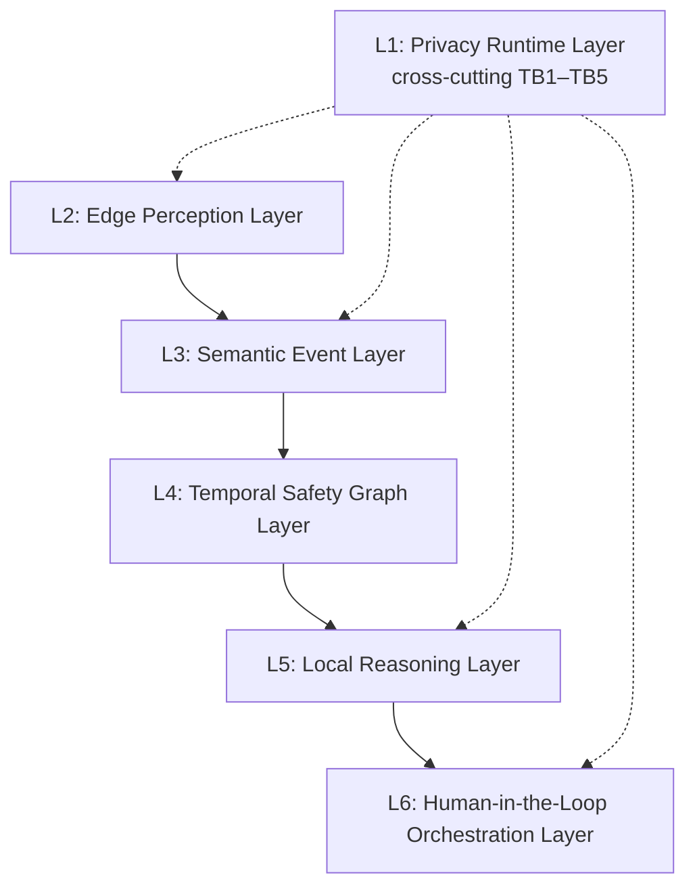

# DUALEXIS Formal Framework

This document specifies the six-layer DUALEXIS research framework for
privacy-first safety orchestration in confined public spaces.
It complements the LaTeX paper (`paper/sections/framework.tex`) and maps directly
to the open-source implementation.

## Scope Exclusions

DUALEXIS does **not** perform:

- Facial recognition
- Biometric identification
- Student or occupant profiling
- Persistent raw video or audio storage
- Automated punitive decision-making

These are architectural invariants enforced by schema validators and the Privacy
Runtime Layer (L1).

## Primary Research Hypothesis

> **H1.** An event-centric, privacy-first, edge-native orchestration architecture
> can improve safety-critical situational awareness in confined public spaces while
> reducing personal data exposure compared to identity-centric or raw-media-centric
> approaches.

This hypothesis is **not empirically validated** in the current release; see
`paper/sections/hypotheses.tex` and `paper/sections/methodology.tex`.

## Framework Overview

L1 wraps all processing stages. Layers L2–L6 form the sequential pipeline.

---

## Layer 1: Privacy Runtime Layer

| Attribute | Definition |
| --------- | ---------- |
| **Purpose** | Enforce privacy policy Π continuously; audit; fail-closed on violation |
| **Inputs** | `PrivacyPolicy`, frames, signals, events, reasoning I/O, egress payloads |
| **Outputs** | Validated artifacts, `AuditEntry`, `PrivacyViolationError` |
| **Privacy constraints** | No biometrics; no persistent media by default; identity linking off |
| **Failure modes** | Policy misconfig; guard bypass; audit gap; TTL failure |
| **Evaluation metrics (planned)** | Biometric rejection rate; post-TTL media count; audit hash pass rate |
| **Implementation** | ✅ `PrivacyPolicy`, `DefaultPrivacyGuard`, validators, `Settings` |

**Code:** `dualexis/privacy/`, `dualexis/schemas/privacy.py`, `dualexis/schemas/domain/validators.py`

---

## Layer 2: Edge Perception Layer

| Attribute | Definition |
| --------- | ---------- |
| **Purpose** | Ephemeral multimodal → anonymized zone-level `PerceptionSignal` |
| **Inputs** | `PerceptionFrame` (in-memory `payload_ref`), zone ID, modality |
| **Outputs** | `PerceptionSignal` with `ZoneDescriptor`, labels, non-biometric features |
| **Privacy constraints** | Edge-only; no raw media in outputs; buffer TTL bound |
| **Failure modes** | Modality dropout; label error; latency > TTL; forbidden feature leakage |
| **Evaluation metrics (planned)** | Per-modality latency; descriptor F1; rejection rate on fuzz |
| **Implementation** | ⚠️ Interface + placeholder pipelines (`video`, `audio`, `sensor`) |

**Code:** `dualexis/perception/`, `dualexis/schemas/perception.py`

---

## Layer 3: Semantic Event Layer

| Attribute | Definition |
| --------- | ---------- |
| **Purpose** | Fuse signals into typed, explainable `SafetyEvent` records |
| **Inputs** | `PerceptionSignal` multiset, `FusionInput`, location/source metadata |
| **Outputs** | `NormalizedEvent`, `FusionResult`, `SafetyEvent`, `SemanticDescriptor` |
| **Privacy constraints** | Zone-only references; validated evidence; retention/privacy tags |
| **Failure modes** | Fusion FP/FN; missing explanations; schema rejection |
| **Evaluation metrics (planned)** | Fusion P/R; explanation completeness; validation pass rate |
| **Implementation** | ✅ Schemas + `DefaultFusionEngine` (placeholder logic) |

**Code:** `dualexis/fusion/`, `dualexis/schemas/domain/events.py`

---

## Layer 4: Temporal Safety Graph Layer

| Attribute | Definition |
| --------- | ---------- |
| **Purpose** | Graph context: zones, events, temporal edges, risk propagation |
| **Inputs** | `SafetyEvent` stream; topology (locations, zones, exits, adjacency) |
| **Outputs** | `EventGraph` context; subgraph JSON; planned Neo4j persistence |
| **Privacy constraints** | No person/identity nodes; zone-scoped queries; window W |
| **Failure modes** | Stale graph; memory growth; bad adjacency; over-propagation |
| **Evaluation metrics (planned)** | Context latency; timeline coherence; prior calibration |
| **Implementation** | ⚠️ `EventGraph` (in-memory); full SSG / Neo4j planned |

**Code:** `dualexis/graph/event_graph.py`, `docs/safety_graph.md`

---

## Layer 5: Local Reasoning Layer

| Attribute | Definition |
| --------- | ---------- |
| **Purpose** | Safety orchestration copilot over structured subgraphs |
| **Inputs** | `ReasoningRequest` (JSON events only; no frames) |
| **Outputs** | `ReasoningResponse` (summary, explanation, action, confidence) |
| **Privacy constraints** | No raw media/biometrics; closed action enum; output identity filter |
| **Failure modes** | Hallucination; ungrounded text; overconfidence; backend down |
| **Evaluation metrics (planned)** | Grounding accuracy; forbidden-term rate; expert Likert scores |
| **Implementation** | ⚠️ `ReasoningEngine` interface + `PlaceholderReasoningEngine` |

**Code:** `dualexis/reasoning/engine.py`, `dualexis/schemas/reasoning.py`

---

## Layer 6: Human-in-the-Loop Orchestration Layer

Publication diagram: [HITL orchestration flow](diagrams/hitl_orchestration_flow.mmd) · [Markdown embed](diagrams/embeds.md#5-human-in-the-loop-orchestration) · rendered [SVG](diagrams/hitl_orchestration_flow.svg)

| Attribute | Definition |
| --------- | ---------- |
| **Purpose** | End-to-end coordination; advisory recommendations; review lifecycle |
| **Inputs** | L3–L5 artifacts; `HumanReviewStatus` from external staff UI |
| **Outputs** | Published events; `OrchestrationRecommendation`; audit trail; API messages |
| **Privacy constraints** | `requires_human_approval=True` default; L1 egress gate; retention honored |
| **Failure modes** | Automation bias; review overload; unsecured API (v0.1); unauthorized escalation |
| **Evaluation metrics (planned)** | Time-to-review; override rate; SA scores; response time |
| **Implementation** | ✅ `SafetyOrchestrator`, publisher, audit; UI/auth planned |

**Code:** `dualexis/orchestration/pipeline.py`, `apps/edge_node/`, `apps/api/`

---

## Framework Invariants

| ID | Invariant |
| -- | --------- |
| I1 | No identity inference in outputs |
| I2 | No persistent raw media |
| I3 | Explainability on risk-related outputs |
| I4 | Human authority for significant actions |
| I5 | Auditability of privacy and orchestration events |

---

## Research Questions (Summary)

| ID | Question |
| -- | -------- |
| RQ1 | Privacy–utility trade-off vs. identity/raw-media baselines |
| RQ2 | Multimodal fusion quality under privacy constraints |
| RQ3 | Temporal graph vs. isolated alerts for SA comprehension |
| RQ4 | Grounded local LLM copilot quality |
| RQ5 | GDPR / EU AI Act engineering evidence via runtime artifacts |
| RQ6 | Edge end-to-end latency |
| RQ7 | Staff workflow with advisory recommendations |
| RQ8 | Federated coordination without raw media |

Full definitions: `paper/sections/research_questions.tex`

## Subsidiary Hypotheses

| ID | Statement |
| -- | --------- |
| H2 | Multimodal fusion beats single-modality on semantic F1 |
| H3 | Temporal graph improves SA comprehension vs. isolated alerts |
| H4 | Structured subgraph LLM beats unstructured scene-text prompts on grounding |
| H5 | L1 rejects 100% adversarial biometric/media injections; zero post-TTL media |

Full definitions: `paper/sections/hypotheses.tex`

## Methodology Phases

1. **Framework specification** (this release) — design + open-source artifact
2. **Privacy audit** — schema fuzz, TB verification, DPIA template
3. **Controlled benchmarks** — synthetic/anonymized data; pre-registered metrics
4. **Field pilot** — ethics-approved staff study

No experimental results are reported in the current paper.

## Reproducibility

- Python 3.12+, Pydantic v2, pinned dependencies (`pyproject.toml`)
- CI: ruff, mypy, pytest (`/.github/workflows/ci.yml`)
- Configuration: `PrivacyPolicy`, `Settings` (`DUALEXIS_*` env vars)
- Evaluation configs: to be added under `examples/evaluation/` with Phase 2

## Module map (framework layers)

| Layer | Package |
| ----- | ------- |
| L1 Privacy Runtime | `dualexis/privacy_runtime/` |
| L2 Edge Perception | `dualexis/edge_perception/` (+ legacy `dualexis/perception/`) |
| L3 Semantic Events | `dualexis/semantic_events/` (+ legacy `dualexis/fusion/`) |
| L4 Temporal Graph | `dualexis/temporal_graph/` (+ legacy `dualexis/graph/`) |
| L5 Local Reasoning | `dualexis/local_reasoning/` (+ legacy `dualexis/reasoning/`) |
| L6 Orchestration | `dualexis/orchestration/` |
| Evaluation | `dualexis/evaluation/` |
| Simulation | `dualexis/simulation/` |

Each layer package contains `interfaces.py`, `models.py`, `service.py`, and `README.md`.

## Core Domain Models

Layer packages define canonical Pydantic v2 domain models that encode the
**process events, not identities** invariant. Legacy schema types under
`dualexis/schemas/domain/` remain for pipeline compatibility; new integrations
should prefer the layer models below.

### SemanticEvent (L3)

| Field | Type | Notes |
| ----- | ---- | ----- |
| `event_id` | `UUID` | Stable event identifier |
| `event_type` | `EventType` | Taxonomy (e.g. `CROWD_ACCELERATION`, `EXIT_BLOCKAGE`) |
| `source` | `EventSource` | Provenance channel (`VIDEO_EDGE_NODE`, `SIMULATOR`, …) |
| `zone_id` | `str` | Anonymized zone scope — no person identifiers |
| `timestamp` | `datetime` | Observation time (UTC) |
| `confidence` | `float` | Normalized score in `[0, 1]` |
| `severity` | `SeverityLevel` | Operational severity |
| `explanation` | `str` | Mandatory human-readable rationale |
| `privacy_level` | `PrivacyLevel` | Data minimization tier |
| `raw_media_persisted` | `bool` | Must remain `False` (default) |
| `metadata` | `dict[str, str]` | Validated key/value tags — no identity terms |

**Code:** `dualexis/semantic_events/models.py`

### RetentionPolicy (L1)

Privacy-first retention contract:

- `raw_media_retention_seconds = 0` and `allow_raw_media_storage = False` by default
- Raw media retention is permitted only when `allow_raw_media_storage=True`
- `DEFAULT_RETENTION_POLICY`: 0 s media, 30 d semantic events, 365 d audit

**Code:** `dualexis/privacy_runtime/models.py`

### OrchestrationRecommendation (L6)

Advisory output with human-in-the-loop gates:

- `HIGH` and `CRITICAL` severities **must** set `requires_human_review=True`
- `HIGH` and `CRITICAL` recommendations **cannot** start with `human_review_status=APPROVED`
- `HumanReviewStatus`: `NOT_REQUIRED`, `PENDING`, `APPROVED`, `REJECTED`, `ESCALATED`

**Code:** `dualexis/orchestration/models.py`

### Temporal Graph (L4)

`TemporalGraphNode` wraps a `SemanticEvent` with an optional local `risk_score`.
`TemporalGraphEdge` links events via `TemporalEdgeKind`
(`TEMPORAL`, `ADJACENCY`, `FUSION`, `RISK_PROPAGATION`).

**Code:** `dualexis/temporal_graph/models.py`

## Related Documentation

- [Architecture](architecture.md)
- [Privacy Model](privacy.md)
- [Semantic Safety Graph](safety_graph.md)
- [Development Guide](development.md)

## Paper Cross-References

| Topic | LaTeX section |
| ----- | ------------- |
| Problem formulation | `paper/sections/problem_formulation.tex` |
| Framework | `paper/sections/framework.tex` |
| Research questions | `paper/sections/research_questions.tex` |
| Hypotheses | `paper/sections/hypotheses.tex` |
| Methodology | `paper/sections/methodology.tex` |
