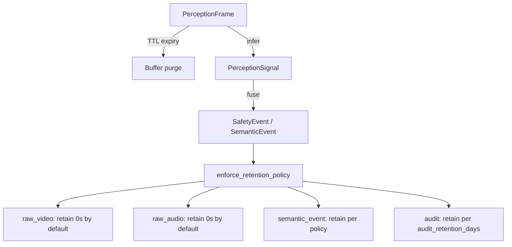

# Privacy Model

DUALEXIS is designed as **privacy-preserving cognitive safety infrastructure**.
This document describes the L1 privacy runtime layer, trust boundaries, retention
rules, reporting, and regulatory alignment.

## Privacy Runtime Layer (L1)

The canonical implementation lives in `dualexis/privacy_runtime/`:

| Module | Responsibility |
| ------ | -------------- |
| `models.py` | `PrivacyPolicy`, `PrivacyViolation`, forbidden field registry |
| `policies.py` | Built-in `strict-v1` default policy |
| `service.py` | `DefaultPrivacyRuntimeService`, payload utilities |
| `report.py` | `PrivacyReport`, `build_privacy_report()` |

Publication diagram: [privacy runtime](diagrams/privacy_runtime.mmd) · [Markdown embed](diagrams/embeds.md#2-privacy-runtime) · rendered [SVG](diagrams/privacy_runtime.svg)

See [embeds.md §2](diagrams/embeds.md#2-privacy-runtime) for the full Mermaid diagram (TB1–TB5 trust boundaries).

## Enforcement Guarantees

The privacy runtime enforces:

| Rule | Default | Mechanism |
| ---- | ------- | --------- |
| Raw video retention | **0 seconds** | `PrivacyPolicy.raw_video_retention_seconds=0` |
| Raw audio retention | **0 seconds** | `PrivacyPolicy.raw_audio_retention_seconds=0` |
| Semantic event retention | **30 days** | `PrivacyPolicy.semantic_event_retention_days` |
| Biometric fields | **Forbidden** | `validate_payload_privacy()` |
| Identity fields | **Forbidden** | `validate_payload_privacy()` |
| Persistent media refs | **Forbidden** | Unless `allow_persistent_media=True` |
| High-risk audit coverage | **Required** | `ensure_high_risk_audit()` |
| Privacy report | **Required** | `build_privacy_report()` on all pipeline outputs |

Violations raise `PrivacyViolationError` (fail-closed). No partial pipeline output is returned when a violation occurs.

## Forbidden Fields

Exact key matches (case-insensitive) are rejected by `validate_payload_privacy()`:

| Category | Fields |
| -------- | ------ |
| Biometric | `face_id`, `biometric_hash`, `facial_embedding`, `face_embedding`, `voiceprint`, `voice_print` |
| Identity | `person_id`, `student_id`, `identity`, `name`, `surname`, `national_id` |
| Media | `raw_video_path`, `raw_audio_path`, `raw_video`, `raw_audio`, `frame_data`, `media_url`, `persistent_media_ref` |

Schema validators in `dualexis/schemas/domain/validators.py` provide additional substring guards.

## Privacy Policy

Default policy (`strict-v1`):

```python
from dualexis.privacy_runtime import DEFAULT_PRIVACY_POLICY

policy = DEFAULT_PRIVACY_POLICY
assert policy.raw_video_retention_seconds == 0
assert policy.raw_audio_retention_seconds == 0
assert policy.allow_persistent_media is False
assert policy.semantic_event_retention_days == 30
```

Biometric enablement raises `ValidationError` at `PrivacyPolicy` construction — not a runtime warning.

## Runtime API

```python
from dualexis.privacy_runtime import (
    DefaultPrivacyRuntimeService,
    enforce_retention_policy,
    strip_raw_media,
    validate_payload_privacy,
)

runtime = DefaultPrivacyRuntimeService()
runtime.reset_session_state()

# Strip raw media keys before egress
clean = strip_raw_media({"zone_id": "hall-a", "raw_video_path": "/tmp/x"})

# Validate nested payloads (raises PrivacyViolationError)
validate_payload_privacy(clean, runtime.active_policy())

# Retention decisions
decision = enforce_retention_policy(runtime.active_policy(), artifact_kind="semantic_event")

# Session report (included in pipeline outputs)
report = runtime.build_report()
```

## Privacy Report

Every pipeline run returns a `PrivacyReport` (`dualexis/privacy_runtime/report.py`):

| Field | Description |
| ----- | ----------- |
| `policy_id` | Active policy identifier |
| `raw_video_retention_seconds` | Configured video retention |
| `raw_audio_retention_seconds` | Configured audio retention |
| `semantic_event_retention_days` | Semantic event retention window |
| `violations` | Structured `PrivacyViolation` records |
| `trust_boundaries_passed` | TB1–TB5 gates cleared |
| `policy_compliant` | Aggregate compliance flag |
| `high_risk_audit_satisfied` | High-risk events have audit records |

## Trust Boundaries

| ID | Boundary | Enforcement |
| -- | -------- | ----------- |
| **TB1** | Ephemeral buffer | `validate_frame()`, `sanitize_frame()` |
| **TB2** | Perception output | `validate_signal()` |
| **TB3** | Event publication | `validate_event()`, `ensure_high_risk_audit()` |
| **TB4** | LLM reasoning | `check_egress()` |
| **TB5** | Network egress | `check_egress()` |

## Retention Flow



## Adapter

`dualexis/privacy/guard.py` provides `DefaultPrivacyGuard`, a legacy adapter that delegates to `DefaultPrivacyRuntimeService`.

## Related Documentation

- [Framework](framework.md)
- [Pipeline](pipeline.md)
- [Threat Model](threat_model.md)
- LaTeX: `results_reference/sections/privacy_threats_governance.tex`
