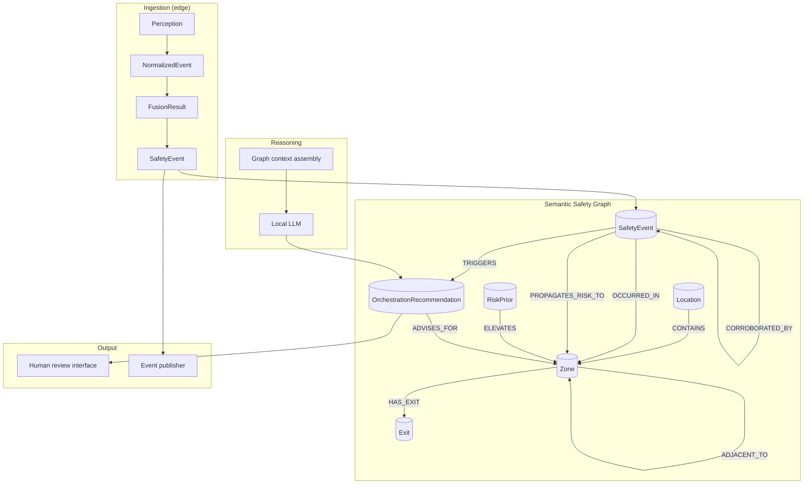

# Semantic Safety Graph

The **Semantic Safety Graph (SSG)** is DUALEXIS's research-oriented knowledge structure
for safety orchestration in confined spaces. It connects **locations**, **zones**,
**exits**, **events**, **temporal transitions**, **risk propagation**, and
**orchestration recommendations** — without storing identities or biometric data.

## Why graph-based orchestration

Isolated event alerts treat each detection as an independent boolean trigger.
Operators receive disconnected notifications with no structural context about
adjacent zones, prior incidents, or corroborating modalities.

The SSG enables:

| Isolated alerts | Graph-based orchestration |
| --------------- | ------------------------- |
| Point-in-time notification | Temporal sequence (`FOLLOWED_BY`) |
| Single-zone myopia | Cross-zone adjacency and propagation |
| Modality silos | Multimodal corroboration edges |
| Opaque escalation | Linked `OrchestrationRecommendation` with provenance |
| Forensic replay (identity-heavy) | Structured situational context (identity-free) |

Graph-based orchestration supports **Endsley-style situational awareness**:
perception (events), comprehension (relationships), and projection (propagation
priors and recommendations).

## Architecture



### Layer responsibilities

| Layer | Component | Role |
| ----- | --------- | ---- |
| Spatial | `Location`, `Zone`, `Exit` | Topology for propagation and egress planning |
| Event | `SafetyEvent`, `SemanticDescriptor` | Typed, explainable observations |
| Temporal | `FOLLOWED_BY`, sliding window | Sequence and evolution |
| Risk | `RiskPrior`, `PROPAGATES_RISK_TO` | Decaying cross-zone influence |
| Orchestration | `OrchestrationRecommendation` | Advisory human-in-the-loop actions |
| Reasoning | Context assembler + local LLM | Comprehension over structured subgraph |

## Node types (identity-free)

| Label | Purpose | Key properties | Prohibited |
| ----- | ------- | -------------- | ---------- |
| `Location` | Site / building | `location_id`, `label`, `site_type` | Address tied to individuals |
| `Zone` | Monitored region | `zone_id`, `zone_label`, `capacity_band` | Person counts by identity |
| `Exit` | Egress point | `exit_id`, `exit_type`, `is_emergency` | Access logs with person IDs |
| `SafetyEvent` | Canonical event | `event_id`, `event_type`, `severity`, `confidence`, `explanation`, `timestamp` | Biometrics, media refs |
| `SemanticDescriptor` | Event semantics | `category`, `description`, `confidence` | Identity attributes |
| `RiskPrior` | Derived propagation state | `prior_score`, `decay_rate`, `expires_at` | Person-linked risk scores |
| `OrchestrationRecommendation` | Advisory action | `action`, `explanation`, `requires_human_approval` | Autonomous enforcement flags |

**Forbidden labels (enforced by policy):** `Person`, `Identity`, `BiometricTemplate`,
`Track`, `FaceEmbedding`.

## Relationship types

| Relationship | From → To | Semantics | Properties |
| ------------ | --------- | --------- | ---------- |
| `CONTAINS` | Location → Zone | Spatial hierarchy | — |
| `ADJACENT_TO` | Zone ↔ Zone | Architectural adjacency | `distance_band` |
| `HAS_EXIT` | Zone → Exit | Egress attachment | — |
| `CONNECTS_TO` | Exit → Zone | Target zone (e.g., exterior) | `direction` |
| `OCCURRED_IN` | SafetyEvent → Zone | Event anchoring | — |
| `FOLLOWED_BY` | SafetyEvent → SafetyEvent | Temporal successor | `delta_ms` |
| `CORROBORATED_BY` | SafetyEvent → SafetyEvent | Multimodal agreement | `modality` |
| `PROPAGATES_RISK_TO` | SafetyEvent → Zone | Risk influence | `alpha`, `lambda`, `score` |
| `ELEVATES` | RiskPrior → Zone | Active prior on zone | `prior_score` |
| `TRIGGERS` | SafetyEvent → OrchestrationRecommendation | Causal link | `confidence` |
| `ADVISES_FOR` | OrchestrationRecommendation → Zone | Advisory scope | — |

## JSON graph schema example

Edge-local subgraph exported for LLM reasoning (no identities):

```json
{
  "subgraph_id": "ctx-8f3a2b1c",
  "assembled_at": "2026-05-25T14:32:00Z",
  "window_minutes": 5,
  "location": {
    "location_id": "site-north-hall",
    "label": "North Building"
  },
  "zones": [
    {
      "zone_id": "z-hall-a",
      "zone_label": "Hallway A",
      "adjacent": ["z-cafeteria"],
      "exits": ["exit-a-north"]
    },
    {
      "zone_id": "z-cafeteria",
      "zone_label": "Cafeteria",
      "adjacent": ["z-hall-a", "z-exit-lobby"],
      "risk_prior": 0.42
    }
  ],
  "exits": [
    {
      "exit_id": "exit-a-north",
      "exit_type": "emergency",
      "connects_to": "exterior-north"
    }
  ],
  "events": [
    {
      "event_id": "e-001",
      "event_type": "acoustic_anomaly",
      "severity": "medium",
      "confidence": 0.71,
      "zone_id": "z-hall-a",
      "timestamp": "2026-05-25T14:30:12Z",
      "explanation": "Sustained elevated sound level consistent with impact-like acoustic pattern.",
      "descriptors": [
        {
          "category": "impact_like",
          "description": "Short impulse followed by reverberation",
          "confidence": 0.68,
          "source_modalities": ["audio"]
        }
      ]
    },
    {
      "event_id": "e-002",
      "event_type": "crowd_activity",
      "severity": "medium",
      "confidence": 0.74,
      "zone_id": "z-cafeteria",
      "timestamp": "2026-05-25T14:30:45Z",
      "explanation": "Aggregate density increase detected; no individual identification performed.",
      "descriptors": [
        {
          "category": "density_elevated",
          "description": "Occupancy band shifted from normal to elevated",
          "confidence": 0.74,
          "source_modalities": ["video"]
        }
      ]
    }
  ],
  "relationships": [
    { "type": "FOLLOWED_BY", "from": "e-001", "to": "e-002", "delta_ms": 33000 },
    { "type": "PROPAGATES_RISK_TO", "from": "e-001", "to": "z-cafeteria", "score": 0.42 },
    { "type": "CORROBORATED_BY", "from": "e-001", "to": "e-002", "modality": "multimodal" }
  ],
  "recommendations": [
    {
      "recommendation_id": "rec-001",
      "action": "request_review",
      "explanation": "Correlated acoustic and crowd events across adjacent zones within 33s window.",
      "requires_human_approval": true,
      "advises_for": "z-cafeteria"
    }
  ]
}
```

## Neo4j conceptual model

### Constraints and indexes

```cypher
// --- Identity-free constraint model ---
CREATE CONSTRAINT location_id IF NOT EXISTS
FOR (l:Location) REQUIRE l.location_id IS UNIQUE;

CREATE CONSTRAINT zone_id IF NOT EXISTS
FOR (z:Zone) REQUIRE z.zone_id IS UNIQUE;

CREATE CONSTRAINT exit_id IF NOT EXISTS
FOR (x:Exit) REQUIRE x.exit_id IS UNIQUE;

CREATE CONSTRAINT event_id IF NOT EXISTS
FOR (e:SafetyEvent) REQUIRE e.event_id IS UNIQUE;

CREATE CONSTRAINT recommendation_id IF NOT EXISTS
FOR (r:OrchestrationRecommendation) REQUIRE r.recommendation_id IS UNIQUE;

CREATE INDEX zone_label IF NOT EXISTS FOR (z:Zone) ON (z.zone_label);
CREATE INDEX event_timestamp IF NOT EXISTS FOR (e:SafetyEvent) ON (e.timestamp);
CREATE INDEX event_severity IF NOT EXISTS FOR (e:SafetyEvent) ON (e.severity);
```

### Spatial topology seed

```cypher
MERGE (loc:Location {location_id: 'site-north-hall', label: 'North Building'})

MERGE (z1:Zone {zone_id: 'z-hall-a', zone_label: 'Hallway A'})
MERGE (z2:Zone {zone_id: 'z-cafeteria', zone_label: 'Cafeteria'})
MERGE (z3:Zone {zone_id: 'z-exit-lobby', zone_label: 'Exit Lobby'})

MERGE (loc)-[:CONTAINS]->(z1)
MERGE (loc)-[:CONTAINS]->(z2)
MERGE (loc)-[:CONTAINS]->(z3)

MERGE (z1)-[:ADJACENT_TO {distance_band: 'immediate'}]->(z2)
MERGE (z2)-[:ADJACENT_TO {distance_band: 'immediate'}]->(z1)
MERGE (z2)-[:ADJACENT_TO {distance_band: 'immediate'}]->(z3)

MERGE (ex:Exit {exit_id: 'exit-a-north', exit_type: 'emergency', is_emergency: true})
MERGE (z1)-[:HAS_EXIT]->(ex)
MERGE (ex)-[:CONNECTS_TO {direction: 'outbound'}]->(:Zone {zone_id: 'exterior-north', zone_label: 'Exterior North'});
```

### Event ingestion and relationships

```cypher
// Acoustic event in Hallway A
MERGE (e1:SafetyEvent {
  event_id: 'e-001',
  event_type: 'acoustic_anomaly',
  severity: 'medium',
  confidence: 0.71,
  explanation: 'Impact-like acoustic pattern detected.',
  timestamp: datetime('2026-05-25T14:30:12Z')
})
WITH e1
MATCH (z1:Zone {zone_id: 'z-hall-a'})
MERGE (e1)-[:OCCURRED_IN]->(z1);

// Crowd event in Cafeteria
MERGE (e2:SafetyEvent {
  event_id: 'e-002',
  event_type: 'crowd_activity',
  severity: 'medium',
  confidence: 0.74,
  explanation: 'Elevated aggregate density; identity-free estimate.',
  timestamp: datetime('2026-05-25T14:30:45Z')
})
WITH e2
MATCH (z2:Zone {zone_id: 'z-cafeteria'})
MERGE (e2)-[:OCCURRED_IN]->(z2);

// Temporal and multimodal links
MATCH (e1:SafetyEvent {event_id: 'e-001'}), (e2:SafetyEvent {event_id: 'e-002'})
MERGE (e1)-[:FOLLOWED_BY {delta_ms: 33000}]->(e2)
MERGE (e1)-[:CORROBORATED_BY {modality: 'multimodal'}]->(e2);

// Risk propagation to adjacent zone
MATCH (e1:SafetyEvent {event_id: 'e-001'}), (z2:Zone {zone_id: 'z-cafeteria'})
MERGE (e1)-[:PROPAGATES_RISK_TO {alpha: 0.6, lambda: 0.05, score: 0.42}]->(z2);
```

### Orchestration recommendation

```cypher
MATCH (e2:SafetyEvent {event_id: 'e-002'}), (z2:Zone {zone_id: 'z-cafeteria'})
MERGE (rec:OrchestrationRecommendation {
  recommendation_id: 'rec-001',
  action: 'request_review',
  explanation: 'Correlated acoustic and crowd events in adjacent zones.',
  requires_human_approval: true,
  confidence: 0.68
})
MERGE (e2)-[:TRIGGERS {confidence: 0.68}]->(rec)
MERGE (rec)-[:ADVISES_FOR]->(z2);
```

### Context query for local LLM (5-minute window)

```cypher
// Anchor event + zone-local temporal neighborhood + adjacent zones
MATCH (anchor:SafetyEvent {event_id: $event_id})-[:OCCURRED_IN]->(zone:Zone)
OPTIONAL MATCH (anchor)-[:FOLLOWED_BY|CORROBORATED_BY*0..3]-(related:SafetyEvent)
WHERE related.timestamp >= anchor.timestamp - duration('PT5M')
OPTIONAL MATCH (zone)-[:ADJACENT_TO]-(adj:Zone)
OPTIONAL MATCH (prop:SafetyEvent)-[pr:PROPAGATES_RISK_TO]->(adj)
OPTIONAL MATCH (anchor)-[:TRIGGERS]->(rec:OrchestrationRecommendation)
RETURN anchor, zone, collect(DISTINCT related) AS context_events,
       collect(DISTINCT adj) AS adjacent_zones,
       collect(DISTINCT {prior: pr.score, zone: adj.zone_id}) AS risk_priors,
       collect(DISTINCT rec) AS recommendations;
```

## Local LLM reasoning over graph context

The reasoning pipeline never receives raw media. Instead:

1. **Subgraph assembly** — `EventGraph.get_context()` (in-memory) or Neo4j context query
   retrieves anchor event, related events, adjacent zones, risk priors, and recommendations.
2. **Structured serialization** — subgraph exported as JSON (see example above) matching
   `ReasoningRequest` fields: `event` + `context_events`.
3. **Grounded prompt** — local LLM receives typed fields only: zone labels, event types,
   severities, explanations, relationship types, and timestamps.
4. **Advisory output** — `ReasoningResponse` with summary, explanation, confidence tier,
   and `recommended_action`; `requires_human_approval=True` by default.

### Prompt structure (conceptual)

```
System: You are a safety orchestration assistant. Reason only over the provided
structured events and zone graph. Do not infer individual identities.

Context subgraph:
{json_subgraph}

Primary event: {event_id} in zone {zone_label}

Tasks:
1. Summarize situational evolution (temporal + adjacent zones).
2. Explain multimodal corroboration if present.
3. Recommend one advisory action for staff (monitor | notify_staff | request_review | escalate | no_action).
```

## Privacy guarantees

| Guarantee | Mechanism |
| --------- | --------- |
| No identity nodes | Forbidden labels; schema validators on event payloads |
| No biometrics | `SemanticDescriptor.evidence` validation rejects embedding keys |
| Bounded retention | Event nodes carry `retention` property; TTL eviction in edge graph |
| Minimal egress | Subgraph exports metadata only; no `raw_video` / `face_embedding` properties |
| Human authority | Recommendations are advisory; no autonomous actuation edges |

## Reference implementation mapping

| SSG concept | Current code (v0.1) | Planned |
| ----------- | ------------------- | ------- |
| Event nodes | `EventGraph.add_event()` | Neo4j adapter |
| Temporal context | `EventGraph.get_context(window=5m)` | `FOLLOWED_BY` edges |
| Zone adjacency | Not yet in code | `SafetyGraphTopology` config |
| Risk propagation | Documented in event model | `RiskPrior` updater |
| Recommendations | `OrchestrationRecommendation` on `SafetyEvent` | `TRIGGERS` edge |
| LLM input | `ReasoningRequest` | Subgraph serializer |

## Related documentation

- [Architecture](architecture.md)
- [Privacy Model](privacy.md)
- [Event Model (paper)](results_reference/sections/event_model.tex)
